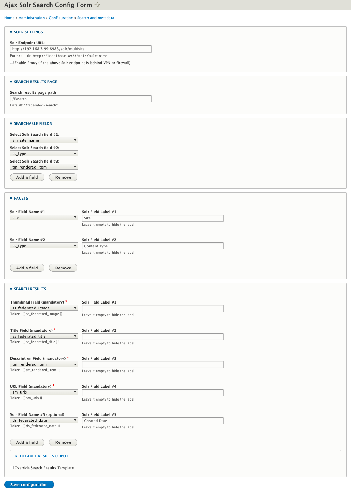

# Ajax Solr for Drupal

## Introduction
Drupal 8/9 module provides a user interface for the Federated Search among multiple Drupal sites which index their content into a shared Solr Core.

## Based project:
* [Ajax Solr](https://github.com/evolvingweb/ajax-solr) is the JavaScript library which provide web based user interface to Apache Solr. The module integrates the library into Drupal framework.

## Federated Search
At Digital Scholarship Unit - UTSC Library, we have developed this module to support search and retrieval using a core that is shared by multiple individual Drupal sites. This allows us to have a federated search across Drupal sites where an end user can conduct a search and see relevant results from multiple sites.

## Requirements
* A Solr endpoint
* A shared Solr core which multisite sites indexing their contents into.
* [Ajax Solr library](https://github.com/digitalutsc/ajax-solr) as dependency library.
* At `/admin/config/search/search-api/index/YOUR_SOLR_INDEX/fields` in each of exhibit sites, setup with Search API fields with the same `MACHINE NAME` and `TYPE`. For example:
  * Field `title`, setting the Machine Name is **`title`**, the Type is **`Fulltext`** as same throughout exhibit sites. Therefore, the title will be indexed to the same field name: **`tm_X3b_en_title`**

## Installation and configuration
* Cloning this module to your module directory of your Drupal site:
  * `git clone https://github.com/digitalutsc/drupal_ajax_solr_search.git`
* Clone the dependency [Ajax Solr library](https://github.com/digitalutsc/ajax-solr) to Libraries directory (ie. drupal/web/libraries):
  * `git clone https://github.com/digitalutsc/ajax-solr.git`
* Enable the module.
* Visit `/admin/config/search/ajax_solr`, fill out the config form with Solr fields which are intented to search against (more in the screenshot below).

## Usage
* Visit the search page at `/federated-search`.
* Live demo: https://find.digital.utsc.utoronto.ca/federated-search

## Please note:

This module won't work if its Drupal site and Solr Endpoint don't have the same Hypertext Transfer Protocol (HTTP). It means that both of Drupal site and Solr endpoint must be either in `https://` or `http://`.

## Maintainers
* [Kyle Huynh](https://github.com/kylehuynh205)
